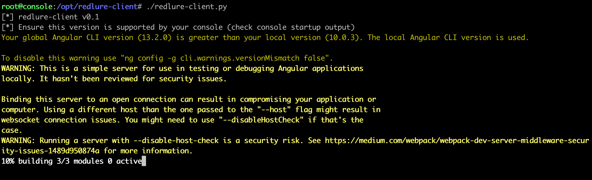
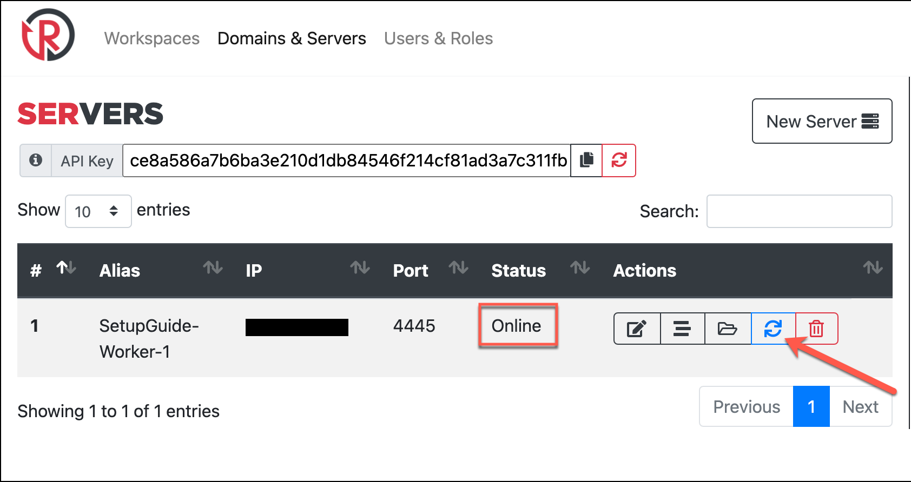

Back in 2019 and 2020 I spent a large chunk of time developing a phishing platform with offensive consultancy in mind. My team first started deploying it privately for phishing during penetration tests in December 2019, until it debuted publicly as part of Demo Labs for DEFCON 28 (August 2020, remote DEFCON). After DEFCON, my focus shifted and I only sporadically updated dependencies and added small features. As of late I've been revisiting the project, including revamping the documentation, moving to a GitBooks site hosted on [docs.redlure.io](https://docs.redlure.io). At the time of release at DEFCON, I didn't have a blog post to accompany the release, with the biggest reason being I didn't have a platform to do so at the time (also was/still am somewhat wary of drawing more eyes to the horrific, unstructured TypeScript portion of the codebase, but oh well). This might end being a long post, but I want this to serve as the missing "on release" blog that explains the tool's background and gives the proper setup guide that I feel has always been lacking. This post *isn't* a promise that my focus in the future will be developing new features, but more of an admission that I think more teams out there might benefit from redlure in its current state and that it's previous documentation and accompanying resources were probably holding it back from doing so.

{: .mx-auto.d-block :}

# The "Why" Behind redlure
There are a few operational deficiencies my team identified in our phishing processes that drove the development of something new. None of these are to suggest that redlure is the ideal solution to the problems presented, or the right solution for every team, but to simply provide a baseline of the development goals.

## Scalability
Working for a consulting firm on a small offensive security team of 5+ people, there are going to be multiple client projects running in parallel. This inevitably means overlapping phishing engagements, but with many tools, you're either limited to phishing from one domain at a time, or maybe even unable to run different campaigns simultaneously. 

To address this, my team used to maintain 3 or 4 individual instances of our phishing platforms to support multiple engagements or even provide flexibility within a single engagement. This usually meant we had to make repetitive updates to various phishing templates across servers or manually aggregate phishing results from separate servers used during a single engagement.

## Focus on Offensive Phishing
Putting user awareness aside, there's usually two goals when phishing in the context of a pentest: harvesting credentials or delivering a C2 payload. 

For credential harvesting, we always desired a simple way to mimic the flow of signing into services like Office365 or Gmail, which utilize separate pages for username and password entry. This login experience that users are familiar with can be difficult to recreate within a phishing framework and is something we frequently setup in hacky ways fully or partially outside our phishing tools. 

On the payload delivery side, we desired a way to incorporate the payload directly into campaigns from our phishing tool, without the need to manually copy it up to exposed directories on phishing servers or needlessly expose our C2 domain by hosting it off Cobalt Strike's web server. 

## Manual Configuration
Phishing is generally time consuming no matter how you slice it, but we found ourselves spending extra time SSHing out to phishing servers to do small manual things like switch domains we're phishing from or generate SSL certs. This was definitely more of a convenience wish than an operational need, but something we thought would be a time saver if it could done from a central location.

# How redlure Attempts to Improve These
## Scalability
redlure attempts to solve this with what I would describe as a distributed or 'hub and spoke' architecture. There's a central API, the redlure-console, which acts as the command center of the framework. The console is the singular point of storage for templates, results and all your phishing-related data. A web UI, the redlure-client, allows you to interact with the console API from a browser. While you're ideally only interacting with the console outside of initial setup, the console doesn't host any of your templated phishing sites on the web - that is the function of the redlure-worker.

Workers get setup on remote servers and host a simpler API that communicates with the console. You can setup and connect a variable number of workers to a single console; sometimes I have only a single worker hooked up to my console, other times my team has had 6 or 7 at once. This allows operators to scale up and down as needed, with the added benefit that if an IP or domain gets burned, you can just destroy the offending worker and replace it with a new one instead of having to stand-up all new phishing infrastructure.

## Focus on Offensive Phishing
When setting up a phishing campaign through the console, you have the ability to chain up to four of your templated webpages together through actions like form submission or button clicks. This allows you the ability to accurately mimic two-step logins or hide your true landing page behind a sort of rudimentary redirect. Four You can read a little more about the setup for these [here](https://docs.redlure.io/redlure-console/pages.html).

On the payload side, payloads can be uploaded directly to workers through the client interface. In campaign configuration options you have the ability to select a payload uploaded to your chosen worker and host it off a configurable URI which is accessible through a variable in your templated emails and webpages.

## Manual Configuration
Ideally, after setup, the client will serve as your single point of interaction with the console and workers. Through the web interface and console API you can remotely generate Let's Encrypt SSL certificates on workers for your domains. Domain usage gets configured at runtime for campaigns, so there is no need to SSH out to workers for either of these. The only thing you should have to handle outside of the client interface is configuring your DNS records. 

# Setup Guide
## Console Setup
I'll setup the console and client off one server. This needs 2GB memory minimum; anything less and I've had issues. The one I'm deploying has 2GB or RAM and 64 GB disk space - $12/month. Firewall rules I typically use can be found [here](https://docs.redlure.io/redlure-console/firewall.html).

First thing to do is update, then install certbot for some SSL certificates.

{: .mx-auto.d-block :}

After that I'll generate some certs for the domain I'll be hosting the console and client from. While the console does not host any phishing pages for you, it does connect to your configured SMTP servers to send email. __There is a chance your console's hostname or reverse DNS lookup could leak through email headers, so choose with this knowledge__.

{: .mx-auto.d-block :}

Next up is [installing](https://docs.redlure.io/redlure-console/Installation.html) the console itself. Python3.9 was already installed on my Ubuntu instance so I'll skip that step and start with `pipenv`. 

{: .mx-auto.d-block :}

{: .mx-auto.d-block :}

Before we actually start the console, we'll want to edit the `config.py` file to add our certificates and a secret key. If we start the console without a secret key configured, it'll suggest a random one for us.

{: .mx-auto.d-block :}

Secret key copied, I'll paste the value into `config.py` and specify my Let's Encrypt certs to use.

{: .mx-auto.d-block :}

Now we can start the console for real (screen/tmux time). The first time you startup, you'll prompted for a passphrase that an encryption key for sensitive database fields will be derived from. __Write this down somewhere__, you'll be prompted to input this if you restart the console.

{: .mx-auto.d-block :}

## Client Setup
On the same cloud instance as the console, I'll [install](https://docs.redlure.io/redlure-client/Installation.html) the client.

Clone the repo and install `npm`.

{: .mx-auto.d-block :}

We'll use `npm` to then install the angular-cli.
{: .mx-auto.d-block :}

Install all the Angular dependencies with `npm install` from the redlure-client directory.

{: .mx-auto.d-block :}

Edit `config.py` to choose a port and set certs.

{: .mx-auto.d-block :}

And start the client!

{: .mx-auto.d-block :}

Now, I am a node noob - this is quite apparent if you look at the TypeScript code (PRs very welcome) - and got lucky that the client started on the first try. There is probably a better way to determine the ever-changing version of node required, but if you start the client and it fails with something about a minimum required Node version, install `nvm` (Node Version Manager) and use it to get the right Node version.

You should be able to login to the web interface now! Default login is `admin`:`redlure`, make sure to get that changed after logging in. Set the console field to the address of the console we stood up earlier.

{: .mx-auto.d-block :}

*__Very important note__: if you setup the console API with self-signed certs, you are going to need to browse to the console's address (i.e. `https://console.domain.com:5000`) and accept the self-signed cert warnings or any attempt by client to login will likely fail.*

At this point, your console is fully functional and you can start adding workspaces, templates, SMTP configs and more.

When designing the web interface and main campaign components, I took a lot of inspiration from [Gophish](https://github.com/gophish/gophish), authored by [Jordan Wright](https://twitter.com/jw_sec). If you've made it this far into the post, I'd assume you do a fair amount of phishing and thus have probably tried Gophish. Gophish is a tool I enjoyed success with in the past and one I think does a lot of things right. In particular, I love how the phishing campaigns feel very modular and easy to switch a single piece in or out of - something I tired to mimic.

## Connecting Workers to the Console
Last thing you'll need before phishing is to [install](https://docs.redlure.io/redlure-worker/Installation.html) one or more workers to host campaigns for you. I'll only be adding one for the purpose of this post, but you can repeat this process to add as many workers as you need.

I usually deploy these on cheap cloud instances with around 1 GB RAM and 32 GB storage. On Vultr these are $6/month, per worker you stand up.

After deploying a new server for the worker, clone the repo and run the `install.sh` script.

{: .mx-auto.d-block :}

This should end with creation of your pipenv environment. If the script fails somewhere along the way, or you don't have Python3.9 available, you can create the virtualenv yourself with `pipenv install` or `pipenv install --python 3.X`
{: .mx-auto.d-block :}

Before editing `config.py` go back to the web console and copy your API key from the *Domains & Servers* page. This will used by both the console and workers to verify traffic coming from the other. You can regenerate your key in the web interface at any time, but doing so will break worker/console communications until you update your workers' configs with the new key.

{: .mx-auto.d-block :}

Add the key to your worker's `config.py` along with the IP/domain name of your console. The certificate configurations here are for the worker API, so I usually just let it generate self-signed certs on startup, although you could specify other certs if you wish.

{: .mx-auto.d-block :}

Now you can start the worker. It will attempt to check-in with your console and you'll see the result in the output. This is a one-way check, (worker -> console only).

{: .mx-auto.d-block :}

Back in the web interface add a new server and input the IP and port your worker is running on. After that, verify two-way console/worker communications are worker with the *Refresh Status* button. You should see the Status column update with *Online*. If you get a different status, you may have copied the API key incorrectly or have firewall rules blocking the traffic. Check the firewall rules applied to your instance or if `ufw` on.

{: .mx-auto.d-block :}

As far as worker setup, everything is complete! While we're on the *Domains & Servers* page, I'll zoom out and add a domain I've pointed to the newly added worker. Domains you add here can be utilized with your campaigns only when pointed at a worker. So although I've black boxed the IPs in the screenshot the IPs of my SetupGuide-Worker-1 and login subdomain match. By clicking the green *Generate Certs* button by the domain, we can generate Let's Encrypt certs for the domain on the corresponding worker. 

{: .mx-auto.d-block :}

If this succeeds, you'll get the message on the green notification bar and also see Certs column flip from *Unset* to *Set*. This will also update the certificate paths in the domain's config with the default Let's Encrypt locations.

# Conclusion
This post got extremely long, without even going into any features post-setup. For the moment, the [DEFCON content](https://youtu.be/ZtCMnKHZJUM) contains examples of setting up campaigns with multi-page web content and integrated payload hosting (jump to [18:23](https://youtu.be/ZtCMnKHZJUM?t=1103) in the video), but I may add a blog or two in the future to demonstrate these. Overall, my hope is that is post will aid anyone interested in deploying redlure for their own engagements, especially anyone that may have been hesitant previously due to a lack of resources/guides like this.